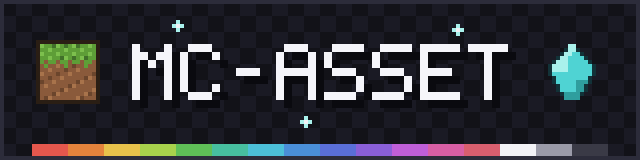

# mc-asset

[English](README.md) | [繁體中文](README.zh-TW.md) | [简体中文](README.zh-CN.md)



专为 Minecraft Java 版资源包打造的像素原生（Pixel-native）2D 资产创作引擎、CLI 工具链与原生 MCP 服务器，面向人类创作者与 AI Coding Agent。

`mc-asset` 解决了大语言模型难以直接精确控制像素视觉内容的痛点。本工具提供确定性的逐像素编辑、程序化纹理生成、无缝贴图接缝分析与修复、动画图集打包、调色板色彩量化与清理，以及完整的资源包规范校验。

---

## 核心特性

- **像素原生引擎（Pixel-Native Engine）**：无论栅格位图（PNG/JPEG/WebP）或纯文本规格（`.grid`/`.mcpx`），载入后均统一转换为内存中的 `PixelCanvas`，以整数坐标与明确的图层/区域范围进行处理。
- **严格确定性（Strict Determinism）**：杜绝未指定种子的随机状态与浮点数舍入误差。在相同输入与种子下，重复运行生成的 PNG 与 `.mcpx` 文件字节完全一致（Byte-identical），并保证 Bun 与 Node 跨运行时一致。
- **Agent 友好设计（Agent-First Architecture）**：标准输出（stdout）与诊断日志（stderr）严格隔离。所有核心命令均支持 `--json` 结构化信封格式，并具备标准化的错误码与状态码规范。
- **双重接口（CLI 与原生 MCP）**：同一套 Core 引擎同时驱动 CLI 与标准 Model Context Protocol（MCP）服务器，可直接接入 Claude Desktop、Cursor、OpenCode 等 AI 开发环境，无须通过外部进程封装。
- **文件系统安全防御（Filesystem Safety）**：拒绝未显式声明的隐式输出文件名。所有写入操作均采用同目录临时文件（`O_EXCL`）与原子重命名（Atomic rename），并通过 Unicode NFC 与大小写折叠进行冲突检测，彻底避免意外覆盖。

---

## 安装指南

### 通过 Homebrew 安装（macOS / Linux）

```sh
brew tap smile-minecraft/tap
brew install smile-minecraft/tap/mc-asset
mc-asset --version
# 0.2.0
```

### 通过源码安装（Bun 或 Node.js）

```sh
git clone https://github.com/smile-minecraft/mc-asset.git
cd mc-asset
bun install --frozen-lockfile
bun run build
./bin/mc-asset.js --version
# 0.2.0
```

*系统环境需求*：已在 [Node.js](https://nodejs.org) 22 与 [Bun](https://bun.sh) 1.3 上测试。`bun run build` 需要 Bun，`./bin/mc-asset.js` 需要 Node.js；只有 Bun 时，改为运行 `bun ./bin/mc-asset.js`。

---

## 快速上手

### 1. 从 ASCII 网格到校验通过的 Minecraft 材质

创建一个可由人类或 Agent 编辑的 16×16 纯文本网格文件：

```sh
mkdir -p /tmp/mc-asset-demo
cat << 'EOF' > /tmp/mc-asset-demo/gem.grid
[palette]
. = transparent
R = #E74C3CFF
D = #C0392BFF
L = #F1948AFF
W = #FFFFFFFF

[grid]
................
......LLLL......
.....LRRRRD.....
....LRRRRRRD....
...LRRRWWRRRD...
...LRRWWWRRRD...
..LRRRWWWRRRRD..
..LRRRRRRRRRRD..
..LRRRRRRRRRRD..
..LRRRRRRRRRRD..
...DRRRRRRRRD...
...DRRRRRRRRD...
....DRRRRRRD....
.....DRRRRD.....
......DDDD......
................
EOF
```

将文本网格渲染为 PNG 材质，并同步保存可重复编辑的 `.mcpx` 源文件：

```sh
mc-asset render /tmp/mc-asset-demo/gem.grid \
  --output /tmp/mc-asset-demo/gem.png \
  --source /tmp/mc-asset-demo/gem.mcpx
# ok render profile=generic applied=0 output=/tmp/mc-asset-demo/gem.png source=/tmp/mc-asset-demo/gem.mcpx
```

分析色彩指标与透明度分布：

```sh
mc-asset analyze /tmp/mc-asset-demo/gem.png
# dimensions: 16x16
# colors: 5
# alpha: predicted cutout (opaque=124 transparent=132 partial=0)
# dominant: #00000000 x132 (0.5156), #E74C3CFF x84 (0.3281), #C0392BFF x20 (0.0781), #F1948AFF x12 (0.0469), #FFFFFFFF x8 (0.0313)
# profile: predicted profile generic has no Minecraft-specific restrictions.
# palette: colorCount=5 alphaLevels=2 transparent=132 partial=0
# pixel-art: 16x16 aspect=1:1 isolated=0 semiTransparent=0 tileFriendly=true
# recommended: quantize.colors=8 cleanup=none resize=nearest
```

校验该资产是否符合 Minecraft 资源包规范：

```sh
mc-asset validate /tmp/mc-asset-demo/gem.png --profile minecraft:item
# verdict: pass
# dimensions: 16x16
# colors: 5
# alpha: predicted cutout (opaque=124 transparent=132 partial=0)
# profile: predicted profile minecraft:item prefers the items atlas without mipmaps.
```

---

## 常用操作实践

### 实践 1：参考图像素化（`pixelize`）

将高分辨率参考图片降采样为符合 Minecraft 风格的像素图案，具备确定性的色彩缩减与边缘对齐：

```sh
mc-asset pixelize reference.png \
  --size 16 \
  --preset item \
  --profile minecraft:item \
  --output item_texture.png
```

- `--preset item`：应用 16 色调色板限制，保留物品边缘清晰度并去除孤立杂讯。
- 支持的预设模板：`item`、`block`、`gui`、`particle`、`generic`。

### 实践 2：程序化材质生成与平铺接缝处理（`generate` 与 `tile`）

生成程序化石材纹理，并进行平铺接缝检测：

```sh
# 使用内置的 stone 调色板生成 16x16 噪声纹理
mc-asset generate noise \
  --size 16 \
  --palette stone \
  --seed 42 \
  --output stone.png

# 测量水平、垂直与角落接缝的不连续度
mc-asset tile stone.png
# ok tile profile=generic seam=h:0.065196 v:0.096051 c:0.003604 repeat=0.908038

# 自动修复接缝瑕疵并预览 4x4 平铺效果
mc-asset tile stone.png \
  --edge-match both \
  --preview 4x4 \
  --output stone_preview.png
```

### 实践 3：色彩量化与像素清理（`quantize` 与 `cleanup`）

清理外部图像工具引入的半透明边缘杂讯与噪点像素：

```sh
# 将色彩量化至 8 色
mc-asset quantize sprite.png --colors 8 --output quantized.png

# 移除孤立噪点与离群像素
mc-asset cleanup quantized.png \
  --fix isolated,noise \
  --allow-render-pass-change \
  --output clean.png
```

### 实践 4：材质梯度衍生（`variant` 与 `recolor`）

将单份源资产拓展为多种金属/材质级别：

```sh
mc-asset variant sword.mcpx \
  --materials iron,copper,gold \
  --output-dir ./dist_variants \
  --mkdir
# 输出 sword_iron.png, sword_iron.mcpx, sword_copper.png, sword_gold.png 等
```

### 实践 5：动画图集打包（`animate`）

将各帧独立的图像打包为符合 Minecraft 规范的垂直连续图集：

```sh
mc-asset animate pack \
  --frames-dir ./textures/fire_frames \
  --layout vertical \
  --output ./textures/fire.png

# 结合对应的 .mcmeta 文件进行动画规格校验
mc-asset validate ./textures/fire.png --mcmeta ./textures/fire.png.mcmeta
```

### 实践 6：资源包完整性扫描（`validate-pack`）

扫描整个资源包根目录，检查缺失贴图、无效命名空间、未引用文件与损坏的模型 JSON 引用：

```sh
mc-asset validate-pack ./MyResourcePack \
  --minecraft-version 26.3 \
  --json
```

---

## MCP 服务器集成（供 AI Agent 调用）

`mc-asset` 内置以标准输入输出（stdio）运行的 Model Context Protocol 服务器。AI 代理可直接调用结构化工具操作核心引擎，无需通过子进程解析 CLI 输出。

### 提供的 MCP 工具

| 工具名称 | 功能描述 |
|---|---|
| `analyze_asset` | 只读分析：尺寸、调色板分布、预测透明度类别、像素画特征启发式指标。 |
| `pixelize_asset` | 将位图（PNG/JPEG/WebP）降采样为像素图，返回 PNG 字节或 `.mcpx` 源码。 |
| `render_pixel_asset` | 渲染内联 ASCII 网格字符串或 `.grid` 文件，支持附加批处理操作。 |
| `apply_asset_operations`| 对 `.mcpx` 源码进行原子批处理像素/图层/区域修改。 |
| `recolor_asset` | 将材质重新映射为内置材质色阶（如 `iron`、`gold`、`stone` 等）。 |
| `create_variants` | 按多种材质批量衍生单份资产至指定目录。 |
| `validate_asset` | 校验单个贴图与 `.mcmeta` 是否符合 Minecraft 规范。 |

### 配置方式

#### Claude Desktop

在 `~/Library/Application Support/Claude/claude_desktop_config.json` 中添加：

```json
{
  "mcpServers": {
    "mc-asset": {
      "command": "mc-asset",
      "args": ["mcp"]
    }
  }
}
```

#### OpenCode

在 `opencode.json` 或 `opencode.jsonc` 中添加：

```jsonc
{
  "mcp": {
    "mc-asset": {
      "type": "local",
      "command": ["mc-asset", "mcp"],
      "enabled": true
    }
  }
}
```

#### Cursor

在您的 MCP 配置文件中添加：

```json
{
  "mcpServers": {
    "mc-asset": {
      "command": "mc-asset",
      "args": ["mcp"]
    }
  }
}
```

---

## CLI 命令一览表

| 分类 | 命令 | 说明 |
|---|---|---|
| **输入与构建** | `import <image>` | 解码 PNG/JPEG/WebP 并输出 PNG 和/或 `.mcpx`。 |
| | `render <grid>` | 将 ASCII 网格（`.grid`）编译为 PNG 和/或 `.mcpx`。 |
| | `build [source]` | 编译 `.mcpx` 源文件或标准输入（`--stdin`）为 PNG。 |
| **空间几何变换** | `transform <input>` | 几何操作：`--flip`、`--rotate`、`--crop`、`--pad`、`--resize`、`--translate`。 |
| **色彩与清理** | `quantize <input>` | 颜色缩减至指定数量（`--colors <N>`）。 |
| | `cleanup <input>` | 清理多余噪点与孤立像素（`--fix isolated,noise,outlier`）。 |
| | `palette extract` | 从图像中提取调色板。 |
| | `palette inspect` | 深入分析调色板分布与明暗对比。 |
| | `material list` | 列出内置 Minecraft 材质定义。 |
| | `material show` | 显示指定材质的色阶定义。 |
| | `recolor <source>` | 依据内置材质重新着色。 |
| | `variant <source>` | 衍生多材质变体到 `--output-dir`。 |
| **程序生成与平铺** | `generate <pattern>` | 确定性程序化纹理生成（支持 `--seed <int>`）。 |
| | `tile <input>` | 接缝瑕疵检测与自动无缝化修复。 |
| | `preview <input>` | 多模式预览：`--ascii`、`--palette-map`、`--scale <N>`、`--nine-slice`。 |
| **动画与图集** | `animate pack` | 将帧目录打包为连续图集。 |
| | `animate unpack` | 将动画图集拆解为独立帧文件。 |
| | `animate reorder` | 重排帧播放顺序。 |
| | `animate resize` | 批量缩放帧尺寸。 |
| | `animate validate`| 依据 `.mcmeta` 校验帧数与布局。 |
| | `animate preview` | 预览动画播放效果。 |
| **校验与诊断** | `analyze <image>` | 只读结构与色彩数值报告。 |
| | `validate <asset>` | 单文件素材规范核验（可附加 `.mcmeta`）。 |
| | `validate-pack <path>`| 资源包全目录关联与完整性核验。 |
| **Agent 接口** | `mcp` | 启动 stdio MCP 服务器。 |

---

## 批量像素修改操作（`--operations`）

在 `import`、`render` 与 `build` 命令中，可通过 `--operations <path>` 或 `--operations -`（stdin）传入批量像素操作：

```json
[
  { "type": "setPixel", "x": 0, "y": 0, "color": "#FF0000FF" },
  { "type": "drawLine", "from": [0, 0], "to": [15, 15], "color": "#00FF00FF" },
  { "type": "fillRect", "rect": { "x": 2, "y": 2, "width": 4, "height": 4 }, "color": "#FFFF00FF" },
  { "type": "floodFill", "x": 5, "y": 5, "color": "#0000FFFF" },
  { "type": "clearPixel", "x": 0, "y": 0 }
]
```

- **原子性保证**：全量执行或全量回滚。批量中若任一操作失败（例如坐标超出边界），之前应用的所有变更均会自动撤销（Rollback）。
- **颜色表示方式**：支持 `transparent`、`#RRGGBB` 或 `#RRGGBBAA`。

---

## 系统架构与可靠性保证

```text
                  ┌─────────────────────────────────┐
                  │          mc-asset Core          │
                  │  PixelCanvas • IO • Algorithms  │
                  └───────────────┬─────────────────┘
                                  │
                 ┌────────────────┴────────────────┐
                 │                                 │
     ┌───────────▼───────────┐         ┌───────────▼───────────┐
     │     CLI Interface     │         │   Native MCP Server   │
     │  (终端命令行与自动化)    │         │     (AI Agent 桥接)   │
     └───────────────────────┘         └───────────────────────┘
```

### 确定性保证机制

1. **字节级一致的 PNG 编码**：采用固定的 deflate 压缩级别与滤波策略（`src/io/png.ts`），搭配纯整数颜色混合计算。输出文件绝不嵌入系统时间戳或主机环境元数据。
2. **种子约束的伪随机数发生器**：程序化纹理生成完全基于整数 xorshift32 PRNG，并严格由 `--seed` 初始化。
3. **跨运行时一致性**：在 Bun 与 Node.js 环境下运行时，生成的二进制字节在 `scripts/compare-runtime.mjs` 比对矩阵所覆盖的命令上，均能达到逐字节（Byte-for-byte）完全吻合。

### 文件系统与 I/O 通道安全

- **原子写入**：写入时先在目标目录创建排他临时文件（`.tmp-<pid>-<counter>-<randomhex>-<原文件名>`），完成后通过原子重命名（Rename）提交，绝不残留写入一半的损坏文件。
- **路径冲突防御**：路径均经过规范化、Unicode NFC 及大小写折叠比对。若输出路径与输入路径冲突且未指定 `--in-place`，或存在重复的目标路径，系统将在写入任何字节前立即终止。
- **通道隔离分工**：
  - 未使用 `--stdout` 时：人类可读日志输出至 stdout。配合 `--json` 时，标准 JSON 信封输出至 stdout，日志则分流至 stderr。
  - 使用 `--stdout` 时：产出的成品二进制字节独占 stdout，JSON 信封与日志强制分流至 stderr。

### 退出状态码表（Exit Codes）

| 状态码 | 类别 | 说明 |
|---|---|---|
| **0** | Success | 操作顺利完成。 |
| **1** | Internal Error | 引擎未预期的内部错误（`INTERNAL_ERROR`）。 |
| **2** | Invalid Invocation | 语法错误、参数冲突、缺少必填参数（`INVALID_ARGUMENT`）。 |
| **3** | Validation Failure | 工具运行正常，但资产或资源包未通过规范校验（`VALIDATION_FAILED`）。 |
| **4** | Filesystem Error | 输出文件已存在且未指定 `--force`，或目录不存在且未指定 `--mkdir`。 |
| **5** | Unsupported Format | 不支持的图片格式或画布尺寸超出系统限制。 |

---

## 开发者命令

```sh
# 运行完整测试套件
bun test

# 运行 TypeScript 类型检查
bun run test:typecheck

# 运行代码规范检查（Linter）
bun run lint

# 打包 Node 发行成品
bun run build

# 校验 Bun 与 Node 跨运行时二进制字节一致性
node scripts/compare-runtime.mjs
```

---

## 开源许可

[MIT](LICENSE) © 2026 Smile Minecraft Project
